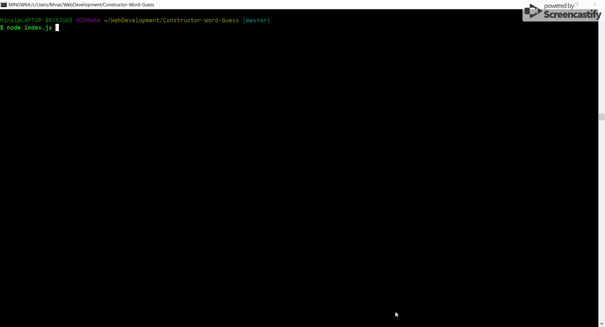
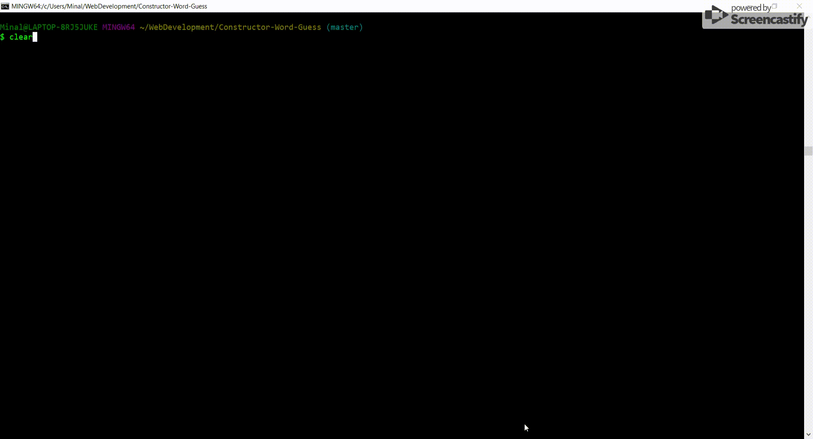

# Constructor-Word-Guess
Word-Guess command line interface game based on JavaScript constructors.

Every time user starts the game he is offered to guess the word related to the internet.

Type 'node index.js' in your command line to begin the game.

Every time you guess a letter, type it in and press Enter to check if your guess is right

Each round user is given 10 attempts to guess the word before he loses. If user runs out of attempts, he gets a message about his loss and the right word in the CLI. 

